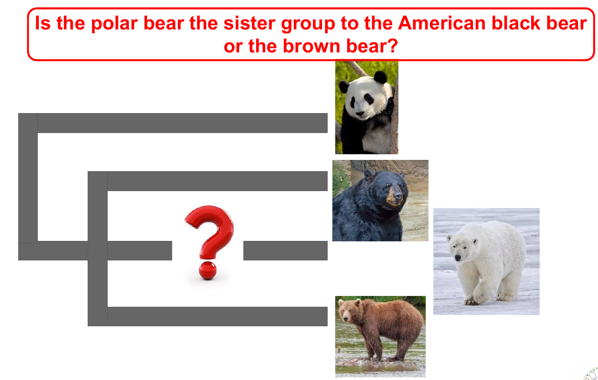
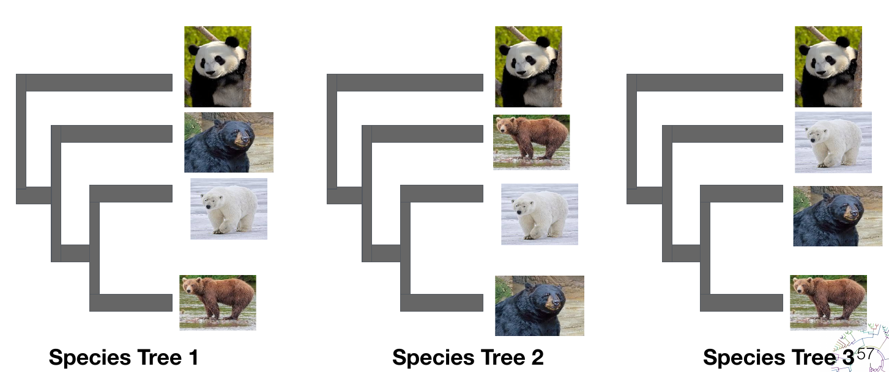

# TESTING THE ROBUSTNESS OF YOUR PHYLOGENY: SENSITIVITY ANALYSES

**Instructors**: Gemma I. Martínez Redondo & Rosa Fernández

If you have any questions, contact us at rosa.fernandez@ibe.upf-csic.es or gemma.martinez@ibe.upf-csic.es

***

## Data files

We will divide the class in two sections. In **Section A**, we will create several data matrices based on different levels of taxon occupancy (directly related to missing data) and homogeneous taxon representation (eg, to ensure that all main lineages are equally represented in our supermatrices). We will then run some quick phylogenetic analyses with the tools learned in previous sessions to test how these factors affect the inferred phylogeny. In **Section B**, we will explore gene tree/species tree conflict and score different phylogenies to test their robustness in light of each individual gene tree. We will also select the ‘best’ genes to run further analyses based on a series of properties (eg, compositional heterogeneity, evolutionary rate, etc.), and will evaluate how the topology changes depending on the genes that we include in our dataset.

All files for this hands-on class are in the folder **`Bear_dataset_SensitivityAnalyses`** provided in the github repository.

As mentioned in the first class, the scientific question we will try to answer today is the following:

 

You can download the data executing the following command from your home directory:

```
ghget https://github.com/ppgcourseUB/ppgcourse2024/tree/main/Sensitivity_Analysis.Rosa_Fernandez_Gemma_Martinez
cd Bear_dataset_SensitivityAnalyses
```

Before executing the python scripts below, you must activate the specific environment for this hans-on session:

`conda activate sensitivity`

***

## Section A. Techniques for data matrix construction

Let’s create different matrices with different taxon occupancy to account for the effect of missing data.

The data is located in the folder: `Bear_dataset_SensitivityAnalyses/MISSING_DATA`

Go to that folder:

`cd Bear_dataset_SensitivityAnalyses/MISSING_DATA`

If you check the list of files in the folder, you’ll see that there are 50 orthologous genes (`number.fa`). They’re already aligned.

There are also 3 python scripts. These scripts need the python libraries numpy and cogent. They are already installed in the cloud for the course, but you will need to install them in your computer to replicate these exercises.

### Taxon ocupancy

1.- Let’s explore the amount of missing data that we have in each taxon. For that, let’s run the script:

`python count_genesPerSpecies.py`

Explore the amount of missing data in each taxon.

- **Which individuals are poorly represented in each species?**

2.- Now let’s select the genes that have a **taxon occupancy above a certain threshold** (ie, we want to create a supermatrix only with the genes that have a minimum of, let’s say, 3 species). Let’s run the script:

`python select_taxon_occupancy.py`

It will ask you to select the minimum taxon occupancy. Let’s start by 3. It will create a folder called `orthologs_min_[number]_taxa`. Open it and check how many genes were selected with this threshold. Run the script with different thresholds and check how the number of selected genes varies.

3.- Let’s now think again on our goal: to resolve the interrelationships between Ursus species. If we select genes just based on taxon occupancy, we may select some that do not include representatives of one or more of the species, and we’ll have a strongly biased dataset.

Let’s select the genes that have an **homogeneous representation of all the four species**.

Let’s open the `decisive_genes.py` script and inspect it together. Note that at the end of the script we’re defining our four species and choosing a minimum number of individuals representing each species in the genes that will be selected (3 in this case). Run the script:

`python decisive_genes.py`

We’ll now have two folders called `Decisive_genes3` and `NonDecisive_genes3`. check how many genes you have in the `Decisive_genes3` one. Change the threshold in the script, rerun it and check how the selected (=decisive) genes change.

- **How do you think this may affect the inferred phylogenetic relationships?**

4.- Feel free to play now or at the end of the class with these scripts to create different matrices, run some trees and see how the topology and the support for each node/lineage changes. 

To do so, first you will need to concatenate the genes selected for each matrix. To build the matrix we will use the software **`catsequences`**. Let's download it:

`cd; cd Sensitivity_Analysis.Rosa_Fernandez_Gemma_Martinez; cd Bear_dataset_SensitivityAnalyses/`

`git clone https://github.com/ChrisCreevey/catsequences.git`

`cd catsequences`

`cc catsequences.c -o catsequences -lm`


We have to create a file with the list of genes that we’d like to concatenate. Let’s create a file with the list of decisive genes. For that, go the folder containing your decisive genes (orthologs_3_fasta)

`cd; cd Sensitivity_Analysis.Rosa_Fernandez_Gemma_Martinez; cd Bear_dataset_SensitivityAnalyses/`

`cd MISSING_DATA/orthologs_min_3_fasta`

and execute the following command:

`ls *.fa > list_decisive_genes.txt`

To concatenate the genes, run the following command:

`../../../catsequences/catsequences list_decisive_genes.txt`

It will create two files: one with the information of the partitions (**`allseqs.partitions.txt`**) and the other one with a concatenated fasta with all genes (**`allseqs.fas`**). This is your matrix!

Once the genes are concatenated, use one of the phylogenetic inference programs that you learned in the previous days to run a quick tree and test how the phylogeny varies depending on the genes that you include. 

- Do you see many differences? What is the factor that is affecting the most in the tests you run?

### genesortR

So far, we’ve been playing with the level of missing data to generate different matrices based on custom python scripts. Ideally, to further test the robustness of your phylogenomic hypotheses you should also generate and analyze other matrices accounting for other confounding factors, such as compositional heterogeneity, level of saturation, etc. 

One of the most complete software we can run for this is **genesortR**, an R package that sorts a set of genes based on several properties. The full documentation can be found here: https://github.com/mongiardino/genesortR

1.- Let’s take our 50 orthogroups and analyze them with genesortR to see which ones are the most adequate to analyze. We will use species tree 1 for this analysis.

Data and scripts are located in: `Bear_dataset_SensitivityAnalyses/GENESORTR`.

Let's move to that folder:

**`cd GENESORTR`**

You will see 3 R scripts, the species tree, the 50 gene alignments concatenated (`50_genes.fa`), its correspondent partitions file (`50_genes.partitions.txt`), and the newick gene trees concatenated (`50_genes.nwk`).

**Note**: If you want to test genesortR on your own data take into account: 1) Partition file must have a specific format; 2) Order of genes in the partitions file and in the file with the concatenated newick gene trees must be the same.

2.- We will execute genesortR with default parameters on our 50 genes with this command:

**`Rscript genesortR.R`**

We’ll obtain a copy of our concatenated alignment, partition file and gene trees sorted by their **phylogenetic usefulness**, from most to least useful.

Take a look at the sorted_figure_50_genes.pdf file obtained.

- **How do gene properties vary according to their phylogenetic usefulness?**

3.- We will now test how selecting the most and the least phylogenetically useful genes affects the tree inferred.

To obtain the 10 **best** genes run:

**`Rscript select_10_best_genes.R`**

To obtain the 10 **worst** genes run:

**`Rscript select_10_worst_genes.R`**

4.- Once we have obtained the smaller alignments, use one of the phylogenetic inference programs that you have used before to run a quick tree and test how the phylogeny varies when using genes with different phylogenetic usefulness.

- **Do you see any differences?**


***

## Section B. Exploring gene tree/species tree conflict

Let’s analyze conflict between individual gene trees to see which phylogenetic hypothesis is the most robustly supported.

 

We have selected 50 orthologous groups and have run individual gene trees with IQ-TREE. Let’s have a look at them here: **`Bear_dataset_SensitivityAnalyses/PHYLIP` (.tree files)**


1.- ASTRAL-III needs all gene trees in the same file. For that, let’s concatenate them: 

**`cat *tree>bears_allTrees.tre`**

Let’s create a folder called ASTRAL and move them at folder:

**`mkdir ASTRAL`**

**`mv bears_allTrees.tre ASTRAL`**

And go to that folder:

**`cd ASTRAL`**

2.- Let’s now run an analysis on the 50 individual gene trees:

**`astral -i bears_allTrees.tre`**

You’ll see the output on the screen. To save it in an output file run:

**`astral -i bears_allTrees.tre 2> output_ASTRAL.txt`**

Examine the output.

- **What is the optimal tree inferred by ASTRAL?**

- **What is the final normalized quartet score?** (tip: the normalized quartet score is the proportion of input gene tree quartet trees satisfied by the species tree. This is a number between zero and 1. The highest the number, the less discordant your gene trees are.

> **Note**. If you install ALSTRAL in your computer, most probably you will need to invoke it through java, similar to this:
> **`java -jar astral.5.7.8.jar -i bears_allTrees.tre 2> output_ASTRAL.txt`**

3.- Visualize the tree in your preferred software or online in iToL or phylo.io (just copy-paste the newick tree and click ‘Render’).

4.- So far, ASTRAL showed us the preferred topology. Let’s now check how our individual gene trees support the alternative topologies.

For that, let’s score each species tree topology and compare the normalized quartered score of each one. Go to the folder `Bear_dataset_SensitivityAnalyses/SPECIES_TREES` and check the three provided species trees. Visualize them and identify the differences.

Let’s now score them with ASTRAL.

Let’s score the first species tree. From the ASTRAL folder, run:

**`astral -i bears_allTrees.tre -q ../SPECIES_TREES/bear_species_tree1.tre 2> score_speciesTree1.txt`**

Do the same with species trees 2 and 3.

Compare the results.

- **Which phylogenetic hypothesis is the most robustly supported?**

- **Which branches are not supported by many genes in each analysis? Does this affect the overall preferred phylogeny of Ursus?**
***
